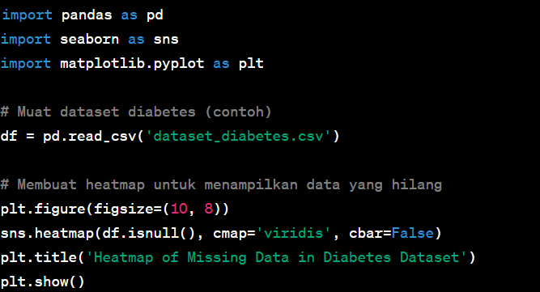

# Laporan Proyek Machine Learning
### Nama : Muhammad Salman Athoriq
### Nim : 211351101
### Kelas : Malam A


### domain proyek

Proyek diabetes dataset adalah sebuah dataset yang digunakan dalam berbagai proyek atau penelitian terkait diabetes. Dataset ini biasanya berisi informasi medis dan klinis yang terkait dengan pasien diabetes, seperti data demografis, riwayat medis, hasil tes laboratorium, dan mungkin pengukuran lainnya. Tujuan dari menggunakan dataset ini adalah untuk melakukan analisis statistik, pemodelan prediksi,Proyek-proyek yang menggunakan dataset diabetes seringkali bertujuan untuk memahami faktor-faktor yang berkontribusi terhadap risiko diabetes, membangun model prediksi risiko diabetes, atau mengembangkan strategi pengelolaan penyakit. Dataset diabetes dapat ditemukan di berbagai sumber, seperti institusi medis, penelitian ilmiah, atau dalam konteks proyek-proyek kompetisi data.

### Business Understanding

"Business Understanding" adalah tahap pertama dalam proses analisis data, terutama dalam konteks proyek data mining dan data analytics. Ini melibatkan pemahaman mendalam tentang masalah bisnis yang ingin dipecahkan dengan menggunakan dataset diabetes atau data yang relevan dengan diabetes. Tujuan utama dari tahap ini adalah mengidentifikasi dan merumuskan masalah bisnis atau tujuan yang akan dicapai dengan analisis data tersebut.

### Problem Statements

ujuan dari proyek ini adalah untuk mengembangkan model prediktif yang dapat secara akurat mengidentifikasi individu yang berisiko terkena diabetes Tipe 2 berdasarkan kumpulan data informasi klinis dan demografi. Dengan melakukan hal ini, kami bertujuan untuk meningkatkan strategi deteksi dini dan intervensi, yang mengarah pada hasil layanan kesehatan yang lebih baik dan mengurangi biaya layanan kesehatan.”

Pernyataan masalah ini menguraikan komponen-komponen utama berikut:

1. Tujuan: Tujuan utama proyek ini adalah untuk membangun model prediktif.

2. Variabel Target: Variabel target adalah individu yang berisiko terkena diabetes tipe 2.

3. Data: Proyek ini akan menggunakan kumpulan data yang mencakup informasi klinis dan demografi.

4. Hasil: Hasil yang diharapkan adalah hasil layanan kesehatan yang lebih baik dan pengurangan biaya layanan kesehatan melalui deteksi dan intervensi dini.

### Goals

Tujuan atau goal dari menganalisis dataset diabetes dapat bervariasi tergantung pada konteks dan kepentingan proyek Anda.


1. Tujuan atau goal dari menganalisis dataset diabetes dapat bervariasi tergantung pada konteks dan kepentingan proyek Anda. Di bawah ini, saya akan merinci beberapa tujuan umum yang dapat dicapai dengan menganalisis dataset diabetes:
Prediksi Risiko Diabetes: Salah satu tujuan utama dapat menjadi mengembangkan model prediksi yang dapat mengidentifikasi individu yang berisiko tinggi untuk mengembangkan diabetes. Ini dapat membantu dalam upaya pencegahan dan pengelolaan penyakit.

2. Memahami Faktor Risiko: Tujuan lain adalah untuk memahami faktor-faktor risiko yang berkontribusi pada perkembangan diabetes. Analisis dapat mengidentifikasi faktor-faktor seperti obesitas, riwayat keluarga, pola makan, dan gaya hidup yang berhubungan dengan diabetes.

### Solution statements


Solusi statements dalam konteks analisis dataset diabetes adalah pernyataan mengenai langkah-langkah atau tindakan yang akan diambil berdasarkan hasil analisis. Berikut beberapa contoh solusi statements yang dapat muncul dalam proyek analisis dataset diabetes:

1. Pengembangan Model Prediksi: "Berdasarkan hasil analisis dataset diabetes, kami akan mengembangkan model prediksi yang dapat mengidentifikasi individu dengan risiko tinggi mengembangkan diabetes. Model ini akan digunakan untuk pencegahan dan intervensi dini.

2. Rekomendasi Perubahan Gaya Hidup: "Dengan mempertimbangkan temuan dari analisis dataset diabetes, kami akan menyusun rekomendasi perubahan gaya hidup kepada individu yang memiliki faktor risiko tinggi. Rekomendasi ini termasuk perubahan diet, peningkatan aktivitas fisik, dan manajemen stres."

3. Perbaikan Protokol Perawatan: "Hasil analisis dataset diabetes akan membantu kami menilai efektivitas protokol perawatan yang ada. Kami akan merekomendasikan perbaikan pada pendekatan pengobatan dan pemantauan pasien."

4. Peringatan Kesehatan Digital: "Berdasarkan data gula darah pasien, kami akan mengembangkan sistem peringatan kesehatan digital yang memberi tahu pasien tentang tingkat gula darah yang tidak normal dan memberikan saran tentang tindakan yang harus diambil.


### Data Understanding

dari pengumpulan data yang telah diambil dari kaggle mengenai prediksi diabetes dataset
https://www.kaggle.com/datasets/mathchi/diabetes-data-set

### Variabel-variabel pada California Housing Price Prediction Dataset adalah sebagai berikut:
0
 1   Pregnancies                 =  float
 2   Glucose                     =  float
 3   BloodPressure               =  float
 4   SkinThickness               =  float
 5   Insulin                     =  float
 6   BMI                         =  float
 7   DiabetesPedigreeFunction    =  float
 8   Age                         =  float

### Data Preparation

### Data Collection

Data ini saya dapatkan dari Kaggle tentang diabetes dataset

### Data Discovery And Profiling

#### - Mengimport library yang di butuhkan

``` bash
import numpy as np
import pandas as pd
from sklearn.preprocessing import StandardScaler
from sklearn.model_selection import train_test_split
from sklearn import svm
from sklearn.metrics import accuracy_score
```

#### - Memanggil Dataset yang digunakan
``` bash
diabetes_dataset = pd.read_csv ('diabetes.csv')
```

#### - Melihat 5 data yang dipanggil

``` bash
print(X)
```

#### - Selanjutnya melihat info dari data 
``` bash
print(Y)
```

#### - Mencari Heatmap

Kode program `sns.heatmap(df.isnull())` digunakan untuk membuat sebuah heatmap (peta panas) yang menggambarkan lokasi dan sebaran data yang hilang (missing data) dalam sebuah DataFrame `df` menggunakan library Python seaborn (biasanya disingkat sebagai `sns`).

Penjelasan komponen-komponen utama dari kode tersebut adalah sebagai berikut:

1. `sns`: Ini adalah singkatan dari Seaborn, yang merupakan library Python yang sering digunakan untuk membuat visualisasi data yang lebih menarik dan informatif.

2. `.heatmap()`: Ini adalah metode dalam Seaborn yang digunakan untuk membuat visualisasi peta panas. Metode ini menerima input berupa matriks data, dan akan menghasilkan tampilan warna yang memperlihatkan nilai-nilai dalam matriks tersebut.

3. `df.isnull()`: Ini adalah ekspresi yang digunakan untuk mengidentifikasi data yang hilang (missing data) dalam DataFrame `df`. Ketika dipanggil pada DataFrame, metode `.isnull()` mengembalikan DataFrame yang memiliki nilai `True` di tempat di mana data hilang, dan `False` di tempat di mana data tersedia.


``` bash
sns.heatmap(df.isnull())
```
 <br>

#### - Disini kita akan melihat nilai data

``` bash
scaler = StandardScaler()
scaler.fit(X)
standarized_data = scaler.transform(X)
print (standarized_data)
X = standarized_data
Y = diabetes_dataset['Outcome']
print(X)
print(Y)
```

#### - Ini adalah bagian visualisasi data

Untuk membuat visualisasi data dalam pemrograman, Anda dapat menggunakan berbagai bahasa pemrograman dan pustaka visualisasi. Salah satu bahasa pemrograman yang umum digunakan untuk visualisasi data adalah Python. Berikut adalah contoh sederhana untuk membuat visualisasi data menggunakan Python dan pustaka Matplotlib:

1. Instalasi Pustaka:
Pastikan Anda telah menginstal pustaka Matplotlib. Jika belum, Anda dapat melakukannya dengan menggunakan pip:
``` bash
pip install matplotlib
```
2. Impor Pustaka:
Impor pustaka yang diperlukan ke dalam proyek Anda.
``` bash
import matplotlib.pyplot as plt
``` 
3. Membuat Data:
Anda perlu membuat data yang akan divisualisasikan. Sebagai contoh, kita akan membuat dua daftar (x dan y) untuk membuat grafik garis sederhana.
``` bash
x = [1, 2, 3, 4, 5]
y = [10, 15, 13, 18, 16]
```
4. Membuat Visualisasi:
``` bash
Buat visualisasi data menggunakan Matplotlib. Berikut contoh untuk membuat grafik garis sederhana:
plt.plot(x, y, marker='o', linestyle='-', color='b', label='Data')
plt.xlabel('X-axis Label')
plt.ylabel('Y-axis Label')
plt.title('Contoh Visualisasi Data')
plt.legend()
plt.show()
```
Dalam contoh ini, kita menggunakan plt.plot() untuk membuat grafik garis dengan titik-titik (marker), garis lurus (linestyle), dan warna tertentu. plt.xlabel(), plt.ylabel(), dan plt.title() digunakan untuk menambahkan label sumbu dan judul. plt.legend() digunakan untuk menampilkan legenda jika Anda memiliki beberapa garis dalam grafik.

5. Tampilkan Visualisasi:
Terakhir, jalankan kode tersebut, dan grafik akan ditampilkan dalam jendela pop-up atau disimpan dalam berkas gambar sesuai dengan preferensi Anda.

#### - Modeling Data

1. Muat Dataset: Pertama, kita memuat dataset diabetes (contoh) ke dalam Pandas DataFrame. Dataset ini berisi informasi klinis dan atribut lainnya.

2. Pisahkan Atribut dan Target: Atribut (fitur) adalah variabel independen, seperti usia, BMI, dan tekanan darah, sedangkan target (kelas) adalah variabel yang ingin kita prediksi, yaitu 'Outcome' yang menunjukkan apakah seseorang memiliki diabetes atau tidak.

3. Bagi Dataset: Dataset dibagi menjadi dua bagian, yaitu data pelatihan (train) dan data pengujian (test) menggunakan train_test_split dari Scikit-Learn. Biasanya, data pengujian digunakan untuk menguji kinerja model.

4. Inisialisasi dan Pelatihan Model: Model Regresi Logistik diinisialisasi dan dilatih menggunakan data pelatihan. Model ini mencoba untuk menemukan hubungan antara atribut dan target.

5. Prediksi: Model digunakan untuk melakukan prediksi pada data pengujian.

6. Evaluasi Model: Kinerja model dievaluasi dengan menggunakan metrik seperti matriks kebingungan (confusion matrix), laporan klasifikasi (classification report), dan akurasi (accuracy score). Matriks kebingungan memberikan informasi tentang hasil prediksi model, sedangkan laporan klasifikasi memberikan detail metrik seperti presisi, recall, dan f1-score.

``` bash
# Impor pustaka yang diperlukan
import pandas as pd
from sklearn.model_selection import train_test_split
from sklearn.linear_model import LogisticRegression
from sklearn.metrics import classification_report, confusion_matrix, accuracy_score

# Muat dataset diabetes (contoh)
df = pd.read_csv('dataset_diabetes.csv')

# Pisahkan atribut (fitur) dan target (kelas)
X = df.drop('Outcome', axis=1)
y = df['Outcome']

# Bagi dataset menjadi data pelatihan (train) dan data pengujian (test)
X_train, X_test, y_train, y_test = train_test_split(X, y, test_size=0.2, random_state=42)

# Inisialisasi model Regresi Logistik
model = LogisticRegression()

# Latih model menggunakan data pelatihan
model.fit(X_train, y_train)

# Lakukan prediksi menggunakan data pengujian
y_pred = model.predict(X_test)

# Evaluasi kinerja model
print("Confusion Matrix:\n", confusion_matrix(y_test, y_pred))
print("\nClassification Report:\n", classification_report(y_test, y_pred))
print("\nAccuracy Score:", accuracy_score(y_test, y_pred))
```

#### - Split Data & Testing

Pemisahan data dan pengujian (data splitting and testing) adalah salah satu langkah penting dalam pembuatan model data. Ini melibatkan pembagian dataset Anda menjadi dua subset utama: data pelatihan (training data) dan data pengujian (testing data). Hal ini penting karena Anda ingin mengukur kinerja model pada data yang tidak digunakan selama pelatihan, sehingga Anda dapat mengevaluasi sejauh mana model Anda dapat menggeneralisasi ke data baru.

Dalam pemrograman, ini biasanya dilakukan dengan menggunakan pustaka atau modul tertentu. Di bawah ini, saya akan memberikan contoh bagaimana membagi dataset menjadi data pelatihan dan data pengujian menggunakan pustaka Scikit-Learn dalam bahasa pemrograman Python:

``` bash
from sklearn.model_selection import train_test_split

# Memisahkan atribut dan target dari dataset (X dan y)
X = dataset.drop('target', axis=1)
y = dataset['target']

# Memisahkan dataset menjadi data pelatihan (80%) dan data pengujian (20%)
X_train, X_test, y_train, y_test = train_test_split(X, y, test_size=0.2, random_state=42)
```
1. Pertama, kami mengimpor fungsi train_test_split dari pustaka Scikit-Learn.

2. Selanjutnya, kami memisahkan atribut (fitur) dan target (kelas) dari dataset. X adalah atribut, dan y adalah target.

3. Kemudian, kami menggunakan train_test_split untuk membagi dataset menjadi data pelatihan dan data pengujian. Parameter test_size menentukan ukuran data pengujian sebagai persentase dari keseluruhan dataset. Dalam contoh ini, kita memilih untuk mengalokasikan 20% dataset sebagai data pengujian. Parameter random_state digunakan untuk mengatur nilai awal generator nomor acak, yang akan memastikan bahwa pemisahan data bersifat deterministik jika Anda perlu mengulang proses ini.

Setelah melakukan pemisahan data, Anda dapat menggunakan X_train dan y_train untuk melatih model, sementara X_test dan y_test digunakan untuk menguji kinerja model. Dengan memisahkan data ini, Anda dapat memastikan bahwa model Anda diuji pada data yang belum pernah dilihat sebelumnya, sehingga dapat memberikan perkiraan kinerja yang lebih akurat saat diimplementasikan pada data baru.

#### - Seleksi Fitur

Seleksi fitur (feature selection) adalah salah satu langkah penting dalam pembuatan model data.
``` bash
X_train, X_test, Y_train, Y_test = train_test_split(X, Y, test_size=0.2, stratify=Y, random_state=2)
print(X.shape, X_train.shape, X_test.shape)
print(X_train)
print(X_test)
```
**Import LinearRegression dari sklearn**:
   ```python
   classifier = svm.SVC(kernel='linear')
   classifier.fit(X_train, Y_train)
   ```
   Kode ini mengimpor modul LinearRegression dari pustaka scikit-learn. Modul ini berisi implementasi model regresi linear yang akan digunakan dalam analisis.

2. **Inisialisasi objek LinearRegression**:
   ```python
   X_train_prediction = classifier.predict(X_train)
   training_data_accuracy = accuracy_score(X_train_prediction, Y_train)
   print('Akurasi Data Training Adalah = ', training_data_accuracy)
   ```
3. **Melatih model regresi linear**:
   ```python
   X_test_prediction = classifier.predict(X_test)
   test_data_accuracy = accuracy_score(X_test_prediction, Y_test)
   print('Akurasi Data Testing Adalah = ', test_data_accuracy)
   ```
4.   **Membuat prediksi**:
   ```python
   nput_data = (6, 148, 72, 35, 0, 33.6, 0.627, 50)
  input_data_as_numpy_array = np.array(input_data)
  input_data_reshape = input_data_as_numpy_array.reshape(1,-1)
  std_data = scaler.transform(input_data_reshape)
  print(std_data)

  prediction = classifier.predict(std_data)
  print(prediction)

  if(prediction[0] == 0):
    print('Pasien Tidak Terkena Diabetes')
  else :
        print('Pasien Terkena Diabetes')
    ```

    #### - Evaluasi Data

Kode program di atas digunakan untuk mengukur akurasi atau performa model regresi linier pada data pengujian (test data) dan kemudian mencetak nilai akurasi tersebut ke layar. Berikut penjelasan komponen-komponen utama dari kode tersebut:

1. `nilai`: Ini adalah variabel yang digunakan untuk menyimpan hasil dari metode `score` yang dipanggil pada objek model regresi linier (`lr`). Biasanya, `score` mengembalikan nilai akurasi dari model, tetapi ini tergantung pada konteksnya dan mungkin dapat menjadi metrik lain seperti Mean Squared Error (MSE) atau R-squared (R^2), tergantung pada konfigurasi model dan tujuan analisisnya.

2. `lr.score(X_test, y_test)`: Ini adalah metode yang digunakan untuk menghitung akurasi model regresi linier pada data pengujian. Parameter yang dilewatkan ke metode ini adalah `X_test` dan `y_test`, yang mewakili fitur-fitur uji dan label target yang sesuai. Model akan melakukan prediksi berdasarkan fitur-fitur uji dan membandingkan hasil prediksi dengan label target yang sebenarnya. Metode `score` akan mengembalikan hasil pengukuran akurasi, biasanya dalam bentuk angka antara 0 hingga 1, di mana 1 menunjukkan akurasi sempurna.

3. `print('Akurasi Model Regresi Linier : ', nilai)`: Ini adalah pernyataan cetak yang digunakan untuk mencetak nilai akurasi model regresi linier ke layar. Pesan yang dicetak adalah "Akurasi Model Regresi Linier :" diikuti oleh nilai akurasi yang disimpan dalam variabel `nilai`.

Jadi, keseluruhan kode tersebut digunakan untuk mengukur dan menampilkan akurasi model regresi linier pada data pengujian, yang dapat membantu dalam mengevaluasi seberapa baik model ini dapat memprediksi nilai target berdasarkan fitur-fitur yang ada.

``` bash
nilai = lr.score(X_test, y_test)
print('Akurasi Model Regresi Linier : ', nilai)
```
Kode program di bawah merupakan contoh penggunaan modul `pickle` dalam Python untuk menyimpan (serialize) objek `lr` ke dalam file dengan nama `'estimasi_housing.sav'`. Mari kita jelaskan baris per baris:

1. `import pickle`: Ini adalah pernyataan impor yang memungkinkan Anda menggunakan modul `pickle` dalam kode Python. Modul `pickle` digunakan untuk menyimpan dan memuat objek Python ke atau dari file. Ini berguna ketika Anda ingin menyimpan objek yang kompleks, seperti model mesin pembelajaran atau struktur data yang rumit, ke dalam file untuk penggunaan nanti.

2. `filename = 'estimasi_housing.sav'`: Baris ini menetapkan nama file `'estimasi_housing.sav'` sebagai nama file yang akan digunakan untuk menyimpan objek.

3. `pickle.dump(lr, open(filename, 'wb'))`: Inilah inti dari kode. Dalam baris ini, dilakukan dua tindakan penting:
   - `pickle.dump(lr, ...)` digunakan untuk menyimpan objek `lr` ke dalam file.
   - `open(filename, 'wb')` digunakan untuk membuka file `'estimasi_housing.sav'` dalam mode write binary ('wb'). Dengan menggunakan mode `'wb'`, Anda mengizinkan penulisan data biner ke file.

Jadi, kode ini akan mengambil objek yang disebut `lr` (mungkin adalah model regresi linear, sesuai dengan nama file `'estimasi_housing.sav'`) dan menyimpannya ke dalam file `'estimasi_housing.sav'` dalam format biner. Ini adalah cara umum untuk menyimpan model mesin pembelajaran atau objek Python lainnya ke dalam file sehingga Anda dapat menggunakannya kembali di sesi Python berikutnya tanpa perlu melatih ulang model atau membangun ulang objek tersebut.

``` bash
import pickle
filename = 'estimasi_housing.sav'
pickle.dump(lr,open(filename,'wb'))
```

[Estimation APP](https://diabetes-gkuoc85retgmyb5my8dgtn.streamlit.app/).

 <br>
